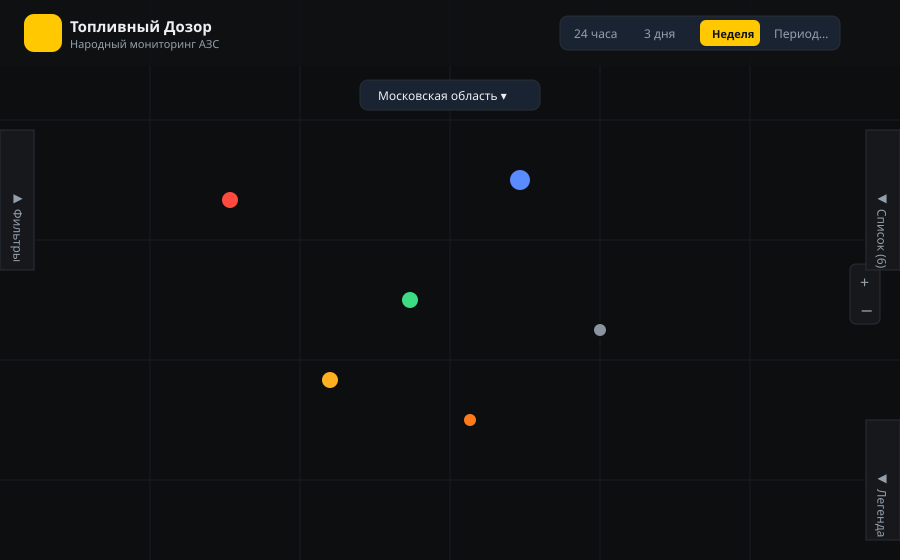

# Документация для установщиков и администраторов

Продакшн-сайт: **[dozor-fuel.online](https://dozor-fuel.online)**



## Требования

- Docker + Docker Compose (рекомендуемый способ запуска инфраструктуры и API/бота).
- Node.js 22+ и npm — для локальной разработки фронтенда без Docker.
- Токен Telegram-бота от [@BotFather](https://t.me/BotFather), если нужен приём обращений (не
  только просмотр карты).

## Быстрый старт — локальная разработка (Docker)

```bash
cp .env.example .env
# заполните BOT_TOKEN в .env, если планируете поднимать бота

docker compose up -d                 # PostgreSQL/PostGIS, Redis, MinIO, инициализация БД, API
docker compose --profile bot up -d   # + Telegram-бот (отдельный профиль, по желанию)
```

Что поднимается (`docker-compose.yml` в корне репо — только для локального dev):

| Сервис | Порт | Назначение |
|---|---|---|
| `db` (PostGIS 16) | 5432 | Основная БД |
| `redis` | 6379 | Rate-limit обращений |
| `minio` | 9000 (API), 9001 (консоль) | Хранилище фото (локально вместо Yandex Object Storage) |
| `api-init` | — | Разовая инициализация схемы + сид демо-данных, затем выходит |
| `api` (FastAPI) | 8000 | Backend API |
| `bot` (профиль `bot`) | — | Telegram-бот, требует `BOT_TOKEN` |

Проверка: `curl http://localhost:8000/health` → `{"status": "ok"}`.

## Деплой на сервер (Yandex Cloud VM)

Для производственного деплоя используется отдельный `deploy/docker-compose.yml`, который:
- Использует **Yandex Object Storage** вместо MinIO.
- Запускает **фронтенд в контейнере** (nginx на порту 80), проксирующем `/api/` на бэкенд.
- Не открывает порты БД/Redis наружу.

Полная инструкция: [`deploy/DEPLOY.md`](../deploy/DEPLOY.md).

## Переменные окружения (`.env`, см. `.env.example`)

| Переменная | Назначение |
|---|---|
| `DATABASE_URL` | Строка подключения к PostgreSQL (`postgresql+asyncpg://...`) |
| `REDIS_URL` | Подключение к Redis |
| `S3_ENDPOINT_URL` / `S3_ACCESS_KEY` / `S3_SECRET_KEY` / `S3_BUCKET` / `S3_PUBLIC_URL` | Объектное хранилище фото (MinIO локально, любой S3-совместимый в проде) |
| `MODERATOR_TOKEN` | Общий секрет для входа в панель модерации (заголовок `Authorization: Bearer <token>`) — **обязательно смените дефолтное значение перед продакшеном** |
| `BOT_TOKEN` | Токен Telegram-бота от BotFather |
| `API_BASE_URL` | Адрес API, который использует бот (внутри docker-сети — `http://api:8000/api/v1`) |

Дополнительные тонкие настройки валидации — в `backend/app/config.py` (не через `.env` по
умолчанию, но легко вынести): `region_bbox` (зона покрытия), `rate_limit_per_hour`,
`dedup_radius_m`, `dedup_window_minutes`, `station_match_radius_m`, `max_event_age_hours`,
`exif_gps_mismatch_km`, `max_photos_per_report`, `max_description_length`.

> ⚠️ `region_bbox` по умолчанию — приблизительный прямоугольник вокруг европейской части России
> (пилотный регион), без Калининградской области (эксклав, не влезает в общий bbox без захвата
> территории Белоруссии/Прибалтики). Это **единственная** зона, где бэкенд примет обращение
> (`point_in_region`). Перед запуском в другом регионе обязательно поменяйте это значение — иначе
> все обращения будут отклоняться как «вне зоны покрытия».

## Запуск фронтенда

```bash
cd frontend
npm install
npm run dev      # разработка, http://localhost:5173
npm run build    # прод-сборка в dist/
```

Приложение — SPA с тремя URL, переключаемыми через History API (без react-router): `/` (лендинг),
`/map` (карта), `/moderation` (панель модератора) — каждый открывается напрямую по ссылке. Для
статического хостинга нужен fallback всех путей на `index.html`; `frontend/public/_redirects`
(формат Netlify/Cloudflare Pages: `/*  /index.html  200`) уже включён в сборку.

### Бесплатный хостинг фронтенда

`dist/` — статические файлы, деплою куда угодно. Бесплатные варианты с готовой поддержкой SPA-fallback:

- **Cloudflare Pages** — `_redirects` уже лежит в `frontend/public/`, ничего доп. настраивать не надо; build command `npm run build`, output `dist`.
- **Netlify** — тот же `_redirects` работает как есть.
- **Vercel** — тоже подходит, но нужен свой `vercel.json` с rewrite на `/index.html` (формат `_redirects` не поддерживается).
- **GitHub Pages** — SPA-роутинг не поддерживает нативно (нет server-side fallback), нужен трюк с `404.html` — для этого проекта проще одна из площадок выше.

Не забудьте задать `VITE_USE_MOCKS=false` и `VITE_API_URL` при сборке для этих площадок, если нужен
реальный бэкенд, а не демо-данные (по умолчанию сборка использует моки).

Переменные окружения фронтенда (Vite, префикс `VITE_`):

| Переменная | По умолчанию | Назначение |
|---|---|---|
| `VITE_USE_MOCKS` | включено (кроме явных `false`/`0`) | Использовать статичные демо-данные (`src/mocks/`) вместо реального API — удобно для UI-разработки без бэкенда |
| `VITE_API_URL` | `/api/v1` | Адрес backend API, если моки выключены |
| `VITE_TELEGRAM_BOT_URL` | `https://t.me/fuelwatch_bot` | Ссылка на бота для кнопок «Сообщить в боте» |

Для прод-сборки с реальным бэкендом: `VITE_USE_MOCKS=false VITE_API_URL=https://ваш-домен/api/v1 npm run build`.

Карта использует внешний тайл-сервис CARTO (`basemaps.cartocdn.com`) — фронтенду нужен исходящий
доступ в интернет. Для продакшена с высоким трафиком стоит учитывать, что это бесплатный демо-стиль
CARTO с ограничениями по нагрузке — рассмотреть самостоятельный хостинг тайлов при росте аудитории.

## Доступ модератора

Модерация защищена одним общим токеном (`MODERATOR_TOKEN` / заголовок `Authorization: Bearer <token>`) — это
осознанное упрощение для небольшой команды на этапе MVP (см. комментарий в
`backend/app/deps.py:require_moderator`). Перед расширением круга модераторов стоит заменить на
полноценные аккаунты с логированием личности модератора (сейчас в лог решений `ModerationLog`
пишется произвольная строка `moderator_id`, которую вводит сам модератор — не аутентифицированная
личность).

Как выдать доступ модератору сейчас: сообщить ему значение `MODERATOR_TOKEN` и адрес панели
(«Модерация» на сайте) — он вводит токен и любой ID на экране входа.

## Демо-данные и сиды

- `backend/scripts/init_db.py` — создание схемы БД.
- `backend/scripts/seed_demo.py` — демонстрационные обращения.
- `backend/scripts/seed_stations.py` — справочник АЗС.

В локальном `docker-compose.yml` `api-init` вызывает все три: `init_db.py` + `seed_demo.py` + `seed_stations.py`. В продовом `deploy/docker-compose.yml` — только `init_db.py` (демо-данные на проде не нужны).

## Резервное копирование

Скрипт `deploy/backup.sh` запускается из crontab пользователя `sayr777`:

```
0 3 * * * /opt/fuel-alert/deploy/backup.sh
```

Что сохраняется:
- **PostgreSQL**: `pg_dump` → gzip → `s3://fuel-alert-backups/db/db_YYYYMMDD.sql.gz`, ротация 30 дней
- **Фото**: инкрементальная синхронизация `s3://fuel-watch-photos/` → `s3://fuel-alert-backups/photos/`
- **Логи**: `/var/log/fuel-alert-backup.log`

### Первичная настройка (выполнено 2026-07-28)

```bash
# 1. AWS CLI v2 (apt не работает на Ubuntu 24.04)
curl "https://awscli.amazonaws.com/awscli-exe-linux-x86_64.zip" -o /tmp/awscliv2.zip
sudo apt install -y unzip && unzip -q /tmp/awscliv2.zip -d /tmp
sudo /tmp/aws/install

# 2. Добавить BACKUP_BUCKET в .env (файл root-owned)
echo "BACKUP_BUCKET=fuel-alert-backups" | sudo tee -a /opt/fuel-alert/deploy/.env

# 3. Создать лог-файл с правами записи
sudo touch /var/log/fuel-alert-backup.log && sudo chmod 666 /var/log/fuel-alert-backup.log

# 4. Выдать скрипту права (сбрасываются после git reset --hard)
sudo chmod +x /opt/fuel-alert/deploy/backup.sh

# 5. Добавить в crontab пользователя (не root!)
crontab -e    # 0 3 * * * /opt/fuel-alert/deploy/backup.sh

# 6. Проверить
/opt/fuel-alert/deploy/backup.sh && tail -20 /var/log/fuel-alert-backup.log
```

> ⚠️ `backup.sh` теряет бит исполнения после `git reset --hard` — после каждого деплоя повторяй `sudo chmod +x`.

### Восстановление БД

```bash
aws s3 ls s3://fuel-alert-backups/db/ --endpoint-url https://storage.yandexcloud.net
aws s3 cp s3://fuel-alert-backups/db/db_20260727.sql.gz /tmp/ \
  --endpoint-url https://storage.yandexcloud.net
gunzip -c /tmp/db_20260727.sql.gz | sudo docker exec -i deploy-db-1 psql -U fuelwatch fuelwatch
```

### Восстановление фото

```bash
aws s3 sync s3://fuel-alert-backups/photos/ s3://fuel-watch-photos/ \
  --endpoint-url https://storage.yandexcloud.net
```

## VPN (Yandex Cloud → Telegram)

Yandex Cloud блокирует исходящие соединения к серверам Telegram. Для работы бота нужен VPN.
Полная инструкция по установке — в [`deploy/DEPLOY.md`](../deploy/DEPLOY.md), раздел «Шаг 6».

Бот запускается с `network_mode: host` — это единственный способ, при котором он использует VPN
хоста. При этом Redis и API-порты должны быть доступны на `127.0.0.1` (см. `deploy/docker-compose.yml`).

**Автопереподключение каждые 5 минут** — крон запускается от **пользователя** (не root),
потому что AdGuard VPN авторизуется под конкретным пользователем, а root-сессия отдельна:

```bash
sudo chmod +x /opt/fuel-alert/deploy/vpn-reconnect.sh

# Добавить в crontab пользователя (НЕ sudo crontab -e!)
crontab -e
# добавить строки:
# */5 * * * * /opt/fuel-alert/deploy/vpn-reconnect.sh
# @reboot sleep 30 && /opt/fuel-alert/deploy/vpn-reconnect.sh
```

Чтобы скрипт мог перезапускать Docker-контейнеры без пароля:

```bash
echo 'ВАШ_ПОЛЬЗОВАТЕЛЬ ALL=(ALL) NOPASSWD: /usr/bin/docker' | sudo tee /etc/sudoers.d/user-docker
```

Скрипт сам проверяет доступность Telegram перед переподключением — VPN не трогается, если всё
работает. Логи: `/var/log/vpn-reconnect.log`.

**После перезагрузки VM** нужно вручную залогиниться в VPN (cron с `@reboot` перезапустит бота автоматически после):

```bash
adguardvpn-cli login          # только если сессия слетела
adguardvpn-cli connect -l "Vilnius"
```

---

## Панель модерации

Доступна по адресу `/moderation`. Авторизация — токен из `MODERATOR_TOKEN`.

### Вкладки

| Вкладка | Статус | Действия |
|---|---|---|
| Очередь | `pending` | Опубликовать ✓ / Отклонить ✕ |
| Опубликованные | `published` | Убрать с карты 🗑 |
| Удалённые | `rejected` | Восстановить ↩ |
| **Истёкшие** | `expired` | Восстановить ↩ |
| Мониторинг | — | DB / Redis / Telegram / Docker / Логи |

**Истёкшие** — репорты, у которых истёк TTL (автоматически переводятся из `published` → `expired` каждые 5 минут). Кнопка ↩ возвращает их в `published` с продлением до следующего TTL-цикла.

### API endpoints

```
GET  /api/v1/moderation/queue
GET  /api/v1/moderation/published
GET  /api/v1/moderation/rejected
GET  /api/v1/moderation/expired          ← добавлено 2026-07-28
GET  /api/v1/moderation/health
GET  /api/v1/moderation/logs/{container}?tail=100
POST /api/v1/moderation/{id}/publish
POST /api/v1/moderation/{id}/reject
POST /api/v1/moderation/{id}/unpublish
POST /api/v1/moderation/{id}/restore     ← принимает rejected и expired
```

## Жизненный цикл репорта и TTL

Репорт проходит статусы: `pending` → `published` → (`expired` или `rejected`).

Фоновая задача `run_expiry_loop` (`backend/app/services/expiry.py`) запускается каждые 5 минут и переводит `published` → `expired` при истечении TTL. TTL задаётся в `backend/app/event_types.py`.

### Актуальные TTL (на 2026-07-28)

| Тип события | TTL |
|---|---|
| Топливо отсутствует | 5 дней |
| Топливо появилось / в наличии | 5 дней |
| Ограничение отпуска | 5 дней |
| Большая очередь | 5 дней |
| Завышенная цена | 5 дней |
| АЗС закрыта | 5 дней |
| Другое | 5 дней |
| Недолив / Контрафакт | 7 дней |
| Незаконная торговля / Мошенничество | 30 дней |

Для изменения TTL — правим `ttl_hours` в `event_types.py`, деплоим только `api`.

## Производительность и CDN (актуально на 2026-07-28)

- **Cloudflare proxy** включён (оранжевое облако для A-записей), режим SSL — **Full**, Brotli работает автоматически
- **MapLibre GL** вынесен в отдельный JS-чанк (`vite.config.ts → manualChunks`) — браузер кеширует его независимо
- **nginx gzip**: уровень 6, `gzip_vary on`, `gzip_proxied any`, тип `application/wasm` добавлен

## Telegram-бот — особенности

- Ссылка на карту `https://dozor-fuel.online` добавлена в ответы `/start` и `/help`
- Описание бота в профиле Telegram задаётся вручную через `@BotFather → /setdescription` — в коде не хранится
- Для типов событий с атрибутом `fuel_grades` бот показывает шаг выбора марок топлива (АИ-92, АИ-95, АИ-98, АИ-100, ДТ, Газ) перед запросом геолокации
- FSM: всегда добавляй фильтр `F.text` на шаги ввода текста + fallback для нетекстовых сообщений

## Эксплуатационные заметки

- Устаревание событий — фоновая задача `run_expiry_loop` (`backend/app/services/expiry.py`),
  запускается в `lifespan` FastAPI-приложения, срок жизни берётся из `ttl_hours` каждого типа
  события (`event_types.py`).
- `region_bbox` — грубый прямоугольник, а не полигон (пропускает точки на границе соседних
  регионов, попадающие в тот же bbox) — для продакшена стоит заменить на честную геометрию региона.
- CORS: в локальном dev открыт (`cors_origins: ["*"]` в `config.py`). В продовом `deploy/docker-compose.yml` передаётся `CORS_ORIGINS: '["${DOMAIN_ORIGIN}"]'`, где `DOMAIN_ORIGIN` задаётся в `.env` — сразу закрытый список.
