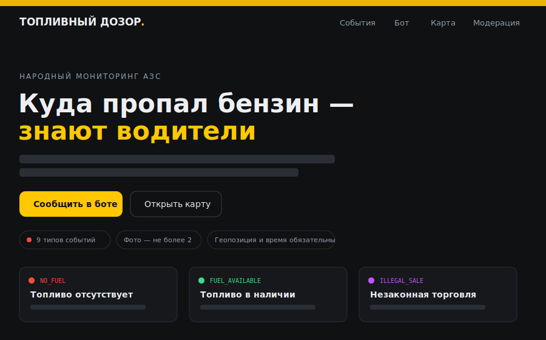
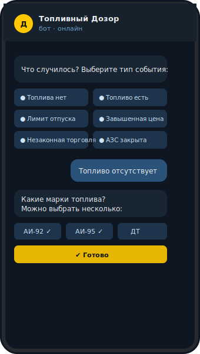
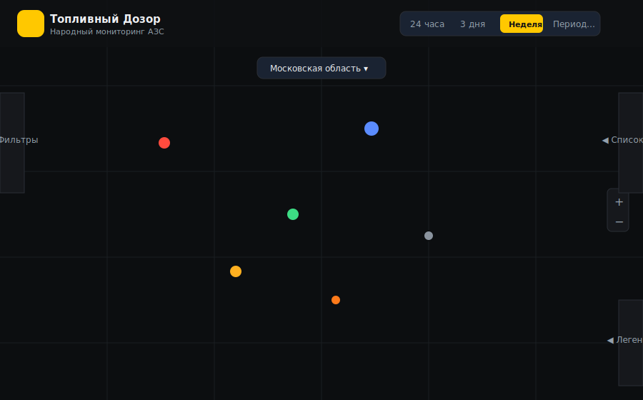
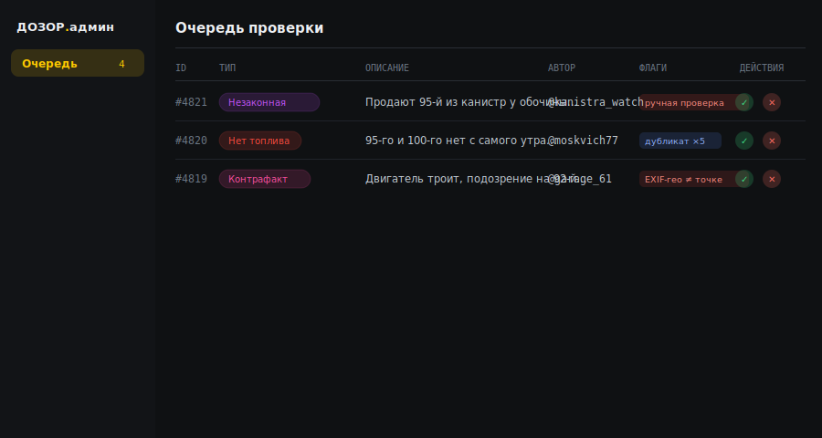

# Экраны приложения

> В проекте нет инструмента для автоматических скриншотов браузера, поэтому ниже — не пиксель-в-
> пиксель скриншоты, а схематичные иллюстрации по реальной цветовой палитре и вёрстке компонентов.
> Чтобы увидеть экраны вживую: `cd frontend && npm run dev`.

Дизайн: тёмная тема, акцент `#FFC800` (жёлтый), шрифты Unbounded (заголовки), Golos Text (текст),
JetBrains Mono (коды/цифры/подписи).

## 1. Лендинг (`components/Landing.tsx`) — экран по умолчанию

Главная страница: заголовок-обещание, кнопки «Сообщить в боте» / «Открыть карту», карточки типов
событий. Полноэкранная страница с прокруткой:

1. **Шапка** — логотип «ТОПЛИВНЫЙ ДОЗОР.», навигация (События / Бот / Карта → открывает карту / Модерация → открывает панель модерации).
2. **Hero** — заголовок «Куда пропал бензин — знают водители», краткое описание, кнопки «Сообщить в боте» (ссылка на Telegram) и «Открыть карту», чипы с ключевыми фактами (число типов событий, лимит фото, обязательность геопозиции, приватность).
3. **Классификатор событий** — карточки типов событий, сгруппированные на «Доступность и обслуживание» / «Нарушения и мошенничество» (группировка по `requires_moderation`), цвет карточки = цвет типа из API/моков, счётчики берутся из реальных данных, а не захардкожены.
4. **«Как это работает»** — 3 шага (сообщение в боте → проверка и склейка дублей → маркер на карте).
5. **Сценарий бота** — 5 иллюстративных «телефонных» экранов, отражающих реальный FSM-сценарий (тип → марки топлива → доп. атрибуты/геопозиция → фото/описание → подтверждение), без вымышленных шагов (в реальном боте нет выбора сети АЗС).

   

   Пример одного экрана из пяти: инлайн-кнопки выбора типа события (шаг 1) и следом — марки
   топлива с множественным выбором и кнопкой «✔️ Готово» (шаг 2), как в реальном FSM-диалоге бота.
6. **CTA-карточки** на карту и на панель модерации (без бутафорских скриншотов интерфейса).
7. **Футер** — блок о приватности (публикуется только ник).

## 2. Карта событий (`components/MapView.tsx` + оверлеи в `App.tsx`)

Основной рабочий экран: тёмная карта с цветными маркерами обращений/АЗС, период и регион в шапке,
сворачиваемые панели фильтров/списка/легенды по краям. Полноэкранная MapLibre-карта (тёмный
векторный стиль CARTO, подписи локализованы на русский) с плавающими элементами поверх:

- **Шапка** (`overlay-header`, сверху): логотип (клик — назад на лендинг), в `header-actions` —
  индикатор загрузки и табло периода (`PeriodControl`: 24 часа / 3 дня / Неделя / Период… с
  поповером выбора дат).
- **Тулбар карты** (по центру сверху): выбор региона (все субъекты РФ + «Вся Россия»; реальные
  данные и валидация есть только по европейской части России — пилотный регион, остальные
  субъекты просто перемещают камеру) и кнопка «Я здесь» (геолокация браузера).
- **Управление зумом** MapLibre — справа по вертикальному центру карты.
- **Панель фильтров** (`FilterPanel`) — сворачиваемая вертикальная вкладка на **левом** крае:
  типы событий (с живыми счётчиками), марки топлива, сети АЗС (переключатели-иконки, включая
  «Без сети» для станций без бренда), период открытия — Показать АЗС (чекбокс), кнопки
  «Обновить»/«Сбросить». Закрыта по умолчанию.
- **Список отчётов** (`ReportList`) — сворачиваемая вкладка на **правом** крае, на одном уровне с
  панелью фильтров. Раскрывает карточки видимых обращений.
- **Легенда** (`Legend`) — сворачиваемая вкладка на правом крае снизу, список цветов типов событий.
- **Маркеры** — точки-обращения (цвет = тип события, размер растёт с числом подтверждений) и
  точки-АЗС (цвет = сеть по `brands.ts`, серый «?» — без сети/неопознанная). Клик — попап
  (`ReportPopup`/карточка станции).

## 3. Панель модерации (`components/ModerationPanel.tsx`)

Таблица очереди обращений, ожидающих решения модератора: тип события цветным бейджем, описание,
автор, флаги автопроверки (EXIF-расхождения, дубликаты) и быстрые действия ✓/✕. Отдельный
полноэкранный вид (без карты):

- **Экран входа** — токен модератора (`X-Moderator-Token`) и ID модератора, хранятся в
  `sessionStorage` на время вкладки.
- **Очередь** — таблица (ID / Тип / Описание / Автор / АЗС / Флаги / Действия). Колонка АЗС
  подтягивается отдельным запросом станций и матчится по `station_id` (публичный API очереди сам
  по себе станцию не отдаёт). Флаги (`review_flags`) показаны читаемыми подписями
  (EXIF-расхождения и т.п.). Действия — быстрые кнопки ✓ (опубликовать) / ✕ (отклонить, с вводом
  причины).
- Кнопка «← Карта» — назад на карту.

## Особенности дизайна

### Цвет = смысл, и это единственный язык статуса

У каждого типа события — фиксированный цвет, одинаковый везде: точка на карте, бейдж в списке
обращений, чип в фильтрах, строка в легенде и в очереди модерации. Один и тот же цвет в разных
местах экрана — это всегда один и тот же тип события, других визуальных состояний (иконок,
паттернов) для типов не используется.

| Тип события | Цвет | Требует модерации |
|---|---|---|
| Топливо отсутствует | 🔴 `#FF4B3E` | нет |
| Топливо в наличии | 🟢 `#3DDC84` | нет |
| Лимит отпуска | 🟠 `#FFB020` | нет |
| Большая очередь | 🔵 `#5B8CFF` | нет |
| Завышенная цена | 🟠 `#FF7A1A` | нет |
| АЗС закрыта | ⚪ `#8A939E` | нет |
| Незаконная торговля | 🟣 `#C554FF` | **да** |
| Подозрение на недолив | 🔵 `#35C8E8` | **да** |
| Контрафактное топливо | 🌸 `#FF4FA0` | **да** |
| Мошенничество | 🟣 `#7C3AED` | **да** |

Типы «требует модерации» не появляются на публичной карте сразу — сначала проходят очередь
проверки (см. панель модерации).

### Сети АЗС — тоже цветом, но это отдельная система

Маркеры станций красятся в фирменный цвет сети (Роснефть, Лукойл, Газпромнефть и т.д. —
`frontend/src/brands.ts`) с короткой аббревиатурой внутри маркера. Серый маркер со знаком «?» —
станция без определённой сети («Без сети»). Не путать с цветами типов событий — это две независимые
цветовые шкалы на одной карте (тип обращения vs сеть заправки).

### Тёмная тема и акцент

Фон почти чёрный (`#0F1113`), акцентный цвет один на весь интерфейс — жёлтый `#FFC800` (кнопки
действия, активные состояния, подсветка выбранного). Если элемент жёлтый — по нему можно
кликнуть или он показывает что-то «сейчас активно». Тёмный фон выбран из-за карты: цветные
маркеры событий контрастнее и не слепят при частом обращении к карте.

### Шрифты — тоже несут смысл

- **Unbounded** — заголовки и крупные цифры (лендинг, шаги «01/02/03»).
- **Golos Text** — весь обычный текст интерфейса.
- **JetBrains Mono** (моноширинный) — коды типов событий (`NO_FUEL`), ID обращений (`#4821`),
  никнеймы, координаты, метки флагов — то, что похоже на «техническое» значение, а не на прозу.

### Сворачиваемые панели — один и тот же приём

Фильтры, список отчётов и легенда на карте — визуально одна и та же конструкция: вертикальная
вкладка с текстом сбоку, разворачивающаяся в панель того же тёмного полупрозрачного цвета
(`rgba(26, 35, 50, .85)` с блюром). Если научились сворачивать/разворачивать одну — так же
работают и остальные две.
